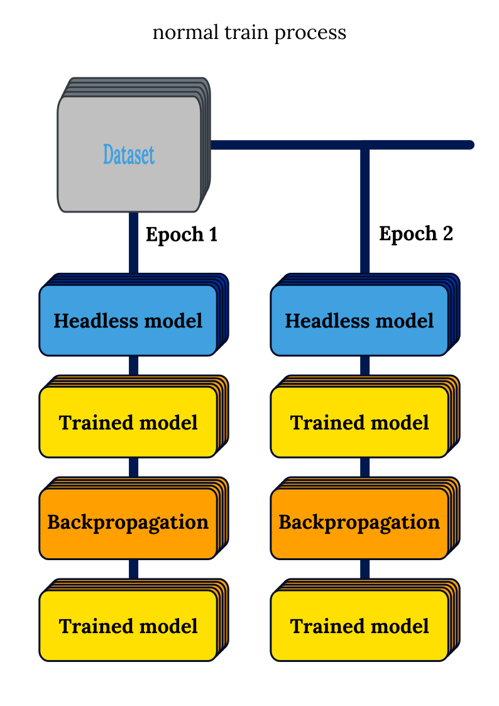

 

# DoF - Deep Model Core Output Framework

New DoF 2.0.0 is arrived. See the *What's new* section below or CHANGELOG.md to explore new features.

## What is this?

DoF is a highly scalable dataset format which helps deep learning scientist to work with foreign and/or sensitive data. DoF provides fast dataset sharing and data-secure at the same time.

## How it works?

Basic workflow in theory looks like following consists of two parts.

### Create DoF dataset

- Collect or find an original dataset.
- Make the needed data augmentation and preprocessing.
- Choose a pre-trained model to use. (Most use cases have their best prectices now.)
- Replace the final classifier or quantifier part of the architecture with empty layer(s).
- Forward the whole dataset through the pre-trained model core.
- Save and publish the outputs in DoF file.

### Use DoF dataset

- Load the DoF dataset
- Build your own classifier module
- Train your classifier module

### Dataflow

The most significant difference between normal training process and training process with DoF is that the characteristics of the raw input data and data augmentation, preprocessing must be separately noticed for further use. This additional data has both common and unique level in the whole dataset.

### Advantages of DoF

#### Secure and Private

Using only huge amount of fully connected nodes makes harder to calculate the original values of input data. Some other processing method makes irreversible destructions of original data like the use of pooling layers. Working with image has a unique approach: the original values does not equals with raw data since a raw image was transformed and normalized before processing. The big and complex networks and pooling layers include the possibility of security. This can be used to protect personal, sensitive or health-related data. In Europe General Data Protection Regulation (GDPR) makes strict border of using data which come from European people. DoF helps to transfer and share data across countries without conflict with GDPR or any other data protection regulation.

#### Efficient

At working with pre-trained models a common solution is to simply cut the classifier and change it with another one. This is not efficient since the frozen (not trained) core of the pre-trained model performs the same calculations over and over again in each epoch. With DoF the result of not trained model can be saved. Only trained layers perform new calculations in the epochs. This is much less time consuming depending on the the size rate between pre-trained model core and the custom classifier.

In most cases storing datasets in DoF is effective in storage size than storing datasets as their own. The size of the data can be precisely estimated since it depends on the shape of the pre-trained model core output only.

*Formulas*

` DIS ` = **D**oF **I**nfo **S**ize

` EC ` = **E**poch **C**ount

` IC ` = **I**mage **C**ount

` IS ` = **I**mage **S**ize

` HNCT ` =  **H**eadless **N**etwork **C**omputation **T**ime

` HOLT ` =  **H**eadless **O**utput **L**oading **T**ime

` HOS ` = **H**eadless **O**utput **S**ize

` TNCT ` = **T**rained **N**etwork **C**omputation **T**ime

**Total saved time**

` (HNCT - HOLT) * EC - HNCT `

**Benefit ratio**

` (TNCT + HOLT) / (HNCT + TNCT) `

**Total benefit ratio**

` ((TNCT + HOLT) * (EC - 1) + (HNCT + TNCT)) / ((HNCT + TNCT) * EC) `

**Total saved space**

` (IS * IC) - (HOS * IC) - DIS `

### Differences between the normal and the DoF train flows

|  |        |
|--------------------------------------------|--------------------------------------------|

## Examples

New examples for version 2.0.0 coming soon.

## Requirements

The python module DoF requires nothing than libraries from the Standard Library.

## What's new in DoF 2.0.0

- New structure for DoF files
- New DoF file type: DoFJSON
- New program structure: core.py, data.py, datamodel.py, file.py, error.py,
  information.py, services.py, storage.py
- Use native typing for every input parameters (`>= Python 3.7`)
- Use init.py
- Dataset information section can be rewritten
- DoF is finally `final`
