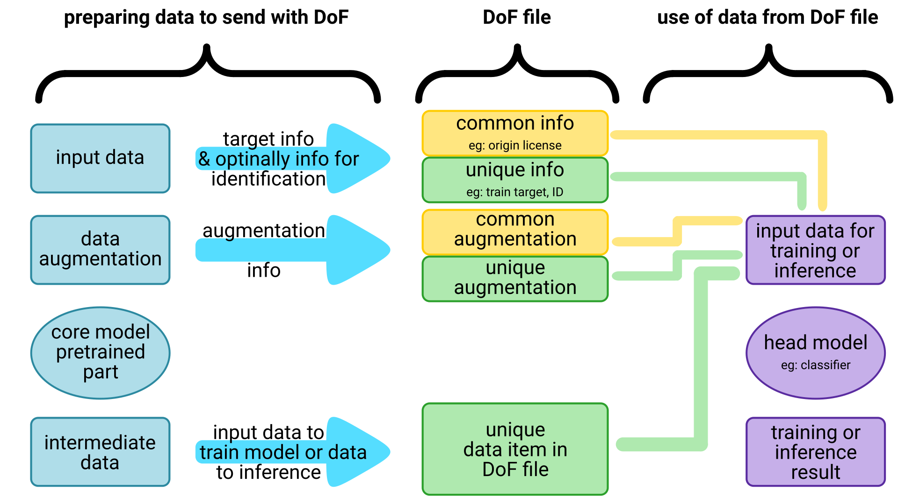

[](https://shields.io/)
[](https://shields.io/)<br>
# DoF - Deep Model Core Output Framework


## What is this?

DoF is a highly scalable dataset format which helps deep learning scientist to work with foreign and/or sensitive data. DoF provides fast dataset sharing and data-secure at the same time.

[](https://youtu.be/r5Qdi29aF8w)

## How it works?

Basic workflow in theory looks like following consists of two parts.

### Create DoF dataset

- Collect or find an original dataset.
- Make the needed data augmentation and preprocessing.
- Choose a pre-trained model to use. (Most use cases have their best prectices now.)
- Replace the final classifier or quantifier part of the architecture with empty layer(s).
- Forward the whole dataset through the pre-trained model core.
- Save and publish the outputs in DoF file.

### Use DoF dataset

- Load the DoF dataset
- Build your own classifier module
- Train your classifier module

### Dataflow

The most significant difference between normal training process and training process with DoF is that the characteristics of the raw input data and data augmentation, preprocessing must be separately noticed for further use. This additional data has both common and unique level in the whole dataset.



### Advantages of DoF

#### Secure and Private

Using only huge amount of fully connected nodes makes harder to calculate the original values of input data. Some other processing method makes irreversible destructions of original data like the use of pooling layers. Working with image has a unique approach: the original values does not equals with raw data since a raw image was transformed and normalized before processing. The big and complex networks and pooling layers include the possibility of security. This can be used to protect personal, sensitive or health-related data. In Europe General Data Protection Regulation (GDPR) makes strict border of using data which come from European people. DoF helps to transfer and share data across countries without conflict with GDPR or any other data protection regulation. 

#### Efficient

At working with pre-trained models a common solution is to simply cut the classifier and change it with another one. This is not efficient since the frozen (not trained) core of the pre-trained model performs the same calculations over and over again in each epoch. With DoF the result of not trained model can be saved. Only trained layers perform new calculations in the epochs. This is much less time consuming depending on the the size rate between pre-trained model core and the custom classifier.

In most cases storing datasets in DoF is effective in storage size than storing datasets as their own. The size of the data can be precisely estimated since it depends on the shape of the pre-trained model core output only.

*Formulas*

` DIS ` = **D**oF **I**nfo **S**ize

` EC ` = **E**poch **C**ount

` IC ` = **I**mage **C**ount

` IS ` = **I**mage **S**ize

` HNCT ` =  **H**eadless **N**etwork **C**omputation **T**ime

` HOLT ` =  **H**eadless **O**utput **L**oading **T**ime

` HOS ` = **H**eadless **O**utput **S**ize

` TNCT ` = **T**rained **N**etwork **C**omputation **T**ime

**Total saved time**

` (HNCT - HOLT) * EC - HNCT `

**Benefit ratio**

` (TNCT + HOLT) / (HNCT + TNCT) `

**Total benefit ratio**

` ((TNCT + HOLT) * (EC - 1) + (HNCT + TNCT)) / ((HNCT + TNCT) * EC) `

**Total saved space**

` (IS * IC) - (HOS * IC) - DIS `

### Differences between the normal and the DoF train flows

|  |        |
|--------------------------------------------|--------------------------------------------|

## Future plans

DoF's aim is to be implemenet for all major deep learning frameworks and programming languages which allow training of a model. Also the missing modes and use cases will be implemented. It would be nice to have an online DoF service to provide datasets from identified and certified authors but this is far behind our resource at the moment.

## Examples

### Creating DoF dataset:

``` python

import dof
import torch
from torchvision import datasets, models, transforms
import tqdm # optional


cleartransform = transforms.Compose([transforms.Resize([224, 224]),
                                     transforms.ToTensor(),
                                     transforms.Normalize(mean=[0.485, 0.456, 0.406],
                                                          std=[0.229, 0.224, 0.225])])
traindata = datasets.ImageFolder('./mydataset', transform=cleartransform))
# Don't need to shuffle since it's not a real training
trainloader = torch.utils.data.DataLoader(traindata, batch_size=BATCH_SIZE, shuffle=False)

coremodel = models.resnet50(pretrained=True)
# Save the exact number of in_features to be able to produce good shape.
in_features = coremodel.fc.in_features
coremodel.fc = EmptyLayer()
coremodel.to(DEVICE)
coremodel.eval()

doffile = dof.DofFile('my_first.dof', dof.DofFile.WRITE, dataset_path='./dof_dataset')
doffile.info(dof.DofInfo(coremodel_family='ResNet', coremodel_type='50',
                         coremodel_common=True, original_author='Foo Bar Doe',
                         original_source='https://github.com/foobar/doe',
                         original_license='Public', dof_author='me',
                         dof_author_contact='me@me.me',
                         dof_source='https://github.com/me/me',
                         dof_license='MIT'))

for x, y in tqdm(trainloader): # It works without tqdm just well

   x = x.to(DEVICE)
   p = coremodel(x)

   # Transform tensors to numpy to spare some more space
   doffile.append((p.cpu().detach().numpy(), y.cpu().detach().numpy()))

   # Deleting variables helps PyTorch to deal with memory better
   del x
   del y
   del p

# Just save and that's it
doffile.save()

```

### Using DoF dataset:

``` python

import dof
import stdout # Only needed to avoid bad appearance of tqdm :-)
import torch
from torchvision import datasets, models, transforms
import tqdm # optional


classifier = MyClassifier(in_features, NUM_CLASSES, MY_DROPOUT)
for param in classifier.parameters():
    param.requires_grad = True

classifier.to(DEVICE)
optimizer = torch.optim.Adam(classifier.parameters(), lr=LEARNING_RATE)
criterion = torch.nn.CrossEntropyLoss()

doffile = dof.DofFile('my_first.dof', dof.DofFile.READ, dataset_path='./dof_dataset')
# Now you can shuffle to avoid serial training
trainloader = torch.utils.data.DataLoader(doffile, batch_size=BATCH_SIZE, shuffle=True)
len_data = len(doffile)
losses, accuracies = [], []

print('Training on {} for {} epoch with {} images...'.format(DEVICE, NUM_EPOCHS, len_data))

for epoch in range(1, NUM_EPOCHS + 1):

    classifier.train()
    epoch_loss = 0.0
    epoch_corrects = 0
    stdout.flush()

    for x, y in tqdm(trainloader):

        x = x.to(DEVICE)
        y = y.to(DEVICE)
        p = classifier(x)
        optimizer.zero_grad()
        loss = CRITERION(p, y)
        loss.backward()
        optimizer.step()

        maxvalues, maxindices = torch.max(p, 1)
        epoch_loss += loss.item()
        epoch_corrects += torch.sum(maxindices == y.data)

    epoch_loss /= len_data
    epoch_accuracy = (float(epoch_corrects) / len_data) * 100.0

    print('\nEpoch {}:'.format(epoch))
    print('- isLoss: {:.4f} - isAccuracy (%): {:7.4f}'.format(epoch_loss, epoch_accuracy))
    stdout.flush()


```

## Requirements

The python module DoF requires nothing than libraries from the Standard Library. However to do training and validation you’ll need at least Deep Learning frameworks like ` PyTorch ` and efficient side modules like ` NumPy `. DoF itself counts on ` NumPy’s ` functionality even if it doesn’t require it be imported. Saving data in ` NumPy ` instead of saving it in ` PyTorch ` means less storage needs.

DoF uses from Standard Library: ` json `, parts of ` os ` and parts of ` os.path `, ` pickle `, parts of ` ZipFile ` .

## Module reference

### Common notations

The variable name ` x ` is used to sign the output of the core model. The letter *x* is selected because core model’s output is used as training model’s input. Therefore we consider x a good naming.

The variable name ` y ` is used to sign the target of the training, test or validation.

### Class reference

#### DofElement

``` python
class DofElement(x, y[, info=None])
```

Represents a dataset element. Its main advantage is that it handles dataset elements in two different ways.

` x ` *(object or string)* The ` x ` value of the element or the path to the file with the value. String type values are always considered as paths.

` y ` *(object)* The corresponding ` y ` value. Since y values are usually much smaller then x values are it is stored in memory only.

` info ` *(DofElementInfo or None)* Additional information to the element or None if no additional information is available. This parameter is optional.

``` python
DofElement.info()
```

Gets information of the element or returns None if no information exists.

``` python
DofElement.islink()
```

Returns ` True ` if element ` x ` value is represented as link or ` False ` if the ` x ` value is in memory.

``` python
DofElement.link()
```

Gets the link of the ` x ` value of the element. Calling this function on a memory based instance leads to error.

``` python
DofElement.x()
```

Gets the ` x ` value of the element no matter if it is in memory or in file.

``` python
DofElement.y()
```

Gets the ` y ` value of the element.

#### DofElementInfo

``` python
class DofElementInfo(**kwargs)
```

Represents information of unique dataset element. Canonical usage is not modify the data after instantiation but there’s no tool in ` python ` to forbid this. However due to clean coding style it worth to act this way.

` **kwargs ` *(key, value pairs)* Keys and values to add basic and more advanced information to dataset element. Required keys are:

- ` author ` : author, owner of the specific element

- ` author_contact ` : contact address (email, phone, homepage, etc.) to the author of the element

- ` source ` : link to the source of the element

- ` license ` : license of the element

Giving further keys and values are available and suggested too.

#### DofError

``` python
class DofError()
```

Represents a Dof module exception. There are various exceptions thrown by the module. Distinct exception is made for cleaner coding purposes since you can separate clearly module errors from any other errors.

#### DofFile

``` python
class DofFile(*args[, dataset_path='./dataset'][, use_compressed=False])
```

Represents a DoF manager. A DoF manager handles a compressed DoF file or a DoF file based dataset. However the DoF manager is not a subclass of ` PyTorch’s DataSet ` class it can be used in ` PyTorch DataLoader ` class as representation of a dataset so don’t have change your training routine in PyTorch to use DoF.

DoF manager has two different modes at the moment. Read mode and write mode. In read mode the manager have 2 different behavior. If file name is given it opens the file and extracts its content to dataset folder. If file name is omitted the manager uses a DoF dataset folder only. In write mode file name is required. The manager collects tha data to save it at the end.

` Positional arguments [file], mode ` *([string], string)* Required argument(s). In read mode 1 argument DofFile.READ is enough if dataset folder contains a fully extracted DoF dataset. If 2 argument is given, 1st argument is treated as the name of the DoF file to read or write and the 2nd argument is the access mode selector.

` dataset_path ` *(string)* Path to the dateset to locate incoming or outgoing files. This parameter is optional since it has default value the folder name **./dataset**.

` use_compressed ` *(bool)* Sets wheter to use dataset compressed or uncompressed. This value is optional. At the moment setting this value doesn’t have any effect because compressed mode is not implemented yet.

``` python
DofFile.append(data)
```

Appends an element or list of elements to dataset.

` data ` *(DofElement or numpy.ndarray like object)* Dataset element or list of dataset elements like a batch for example. In case of a single element the element should be ` DofElement ` in case of multiple elements, the elements should implement ` .shape() ` and ` .tolist() ` functions like ` numpy.ndarray ` does.

``` python
DofFile.check()
```

Checks if DoF dataset has every needed element. At the moment this function is implemented for read mode with uncompressed behavior only.

``` python
DofFile.delete(id)
```

Deletes an element from the dataset. In read mode the element is deleted for this specific session only. In write mode deleting an element means the element will be deleted from the saved dataset too.

` id ` *(int)* The index (postion) of the element in the dataset.

``` python
DofFile.filename()
```

Gets the file name string bound to the dataset. If file name was omitted, it returns an empty string.

``` python
DofFile.info([newvalue=None])
```

Gets or sets the dataset level information.

` newvalue ` *(DofInfo or None)* If ` DofInfo ` instance is given, it is set as new dataset info. If ` None ` is given, the current dataset info is returned.

``` python
DofFile.mode([mode=None])
```

Gets or sets the Dof manager mode.

` mode ` *(String or None)* If mode is ` DofFile.READ ` or ` DofFile.WRITE ` new mode will be set in the future but at the time this is not allowed. If ` None ` is given the current mode is returned.

``` python
DofFile.save([remove_dataset_dir=False])
```

Saves the dataset to a DoF file.

` remove_dataset_dir ` *(bool)* Whether or not dataset directory should be removed at the and of save.

``` python
DofFile.use_compressed([newvalue=None])
```

Gets or sets the Dof uncompressed mode.

` newvalue ` *(bool or None)* If newvalue is ` bool ` the new mode will be set in the future but at the moment it is not implemented yet. If ` None ` is given it returns the current use_compressed state.

``` python
DofFile.__getitem__(id)
```

Gets an item. This method provides compatibility with Pytorch’s DataSet and DataLoader.

` id ` *(int)* The id of the element to return.

``` python
DofFile.__iter__()
```

Gets an iterable instance, gets the instance itself. This method provides iterable functionality of DoF manager.

``` python
DofFile.__len__()
```

Gets the length of the dataset. This method serves for compatibility with iterators and PyTorch as well.

``` python
DofFile.__next__()
```

Gets next element from dataset. This method provides iterable functionality of DoF manager.

#### DofInfo

``` python
class DofInfo(*args, **kwargs)
```

Represents information of the whole dataset. Canonical usage is not modify the data after instantiation but there’s no tool in ` python ` to forbid this. However due to clean coding style it worth to act this way.

` args ` *(positional arguments is [dict])* List if dict with length 1. (This way is reserved for DofFile read mode’s JSON based instantiation only.)

` **kwargs ` *(key, value pairs)* Keys and values to add basic and more advanced information to dataset. Required keys are:

- ` coremodel_family ` : Identification name of the core model (e.g. **ResNet**).

- ` coremodel_type ` : Subclass name of the core model (e.g. **50**).

- ` coremodel_common ` : ` True ` or ` False ` Whether the core model is common or not. Being common means that it’s available in most Deep Learning frameworks.

- ` original_author ` : Author, owner of the original dataset.

- ` original_source ` : Link (or other availability) to the original dataset.

- ` original_license ` : License of the original dataset.

- ` dof_author ` : Author (compiler, owner) of the DoF dataset.

- ` dof_author_contact ` : Contact address (email, homepage, phone, etc.) to the author of the DoF dataset.

- ` dof_source ` : Link to the DoF dataset.

- ` dof_license ` : License of the DoF dataset.

In case if ` coremodel_common ` is ` False ` further keys are required:

- ` coremodel_source_architecture ` : Link to the surce of the core model.

- ` coremodel_source_weightsandbiases ` : Link to the wights and bias data of the core model architecture.

Giving further keys and values are available and suggested too.
